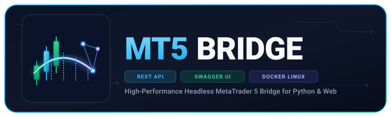

<p align="center">
  
</p>

<p align="center">
  <a href="https://opensource.org/licenses/Apache-2.0"></a>
  <a href="https://github.com/liberatti/mt5bridge"></a>
  <a href="https://www.docker.com/"></a>
  <a href="http://localhost:5000/"></a>
  <a href="https://www.python.org/"></a>
  <a href="https://palletsprojects.com/p/flask/"></a>
  <a href="https://github.com/sponsors/liberatti"></a>
</p>

High-performance, modular, and headless Docker solution designed to run **MetaTrader 5 (MT5)** on Linux via **WineHQ Staging**, exposing **all official MetaTrader 5 methods** through a robust **Python Flask REST API** with built-in **interactive Swagger UI / OpenAPI 3.0** documentation.

Based on the official MQL5 reference: [MetaTrader 5 on Linux](https://www.mql5.com/en/articles/625).


---

## ✨ Key Features

- 🐳 **Headless Linux Environment**: Runs MT5 terminal silently using WineHQ Staging + Xvfb virtual display with zero GUI overhead.
- 📖 **Built-in Interactive Swagger UI**: Full OpenAPI 3.0 documentation served at the root URL (`/`) with interactive *"Try it out"* request execution.
- ⚡ **Full MT5 Python API Coverage**: 100% method compatibility for Account, Symbols, Depth of Market (DOM), Historical Rates & Ticks, Orders, Positions, and Deals.
- 🛠️ **High-Level Trading Helpers**: Simplified endpoints for opening market/pending orders, modifying SL/TP, and closing positions.
- 🧱 **Standardized JSON Schema**: Predictable response structure and error handling powered by the `nxcore` framework.
- 🔄 **Auto-Recovery & Reconnect**: Background connection watchdog, automated initialization, and persistent Wine prefix volumes.

---

## 🏗️ Architecture Overview

```text
┌───────────────────────────────────────────────────────────┐
│                    Client Applications                    │
│   (Web Apps / Python Scripts / Trading Bots / Postman)    │
└─────────────────────────────┬─────────────────────────────┘
                              │ HTTP / REST (Port 5000)
                              ▼
┌───────────────────────────────────────────────────────────┐
│                  Docker Container: mt5bridge              │
│                                                           │
│   ┌───────────────────────────────────────────────────┐   │
│   │  Swagger UI / OpenAPI 3.0 Documentation (/)       │   │
│   │  Flask REST API (Waitress Multi-threaded WSGI)    │   │
│   └─────────────────────────┬─────────────────────────┘   │
│                             │ TCP Socket (Port 22347)     │
│                             ▼                             │
│   ┌───────────────────────────────────────────────────┐   │
│   │  RestGateway Expert Advisor (MQL5)                │   │
│   │  MetaTrader 5 Terminal 64-bit                     │   │
│   │  WineHQ Staging + Xvfb Display Server             │   │
│   └─────────────────────────┬─────────────────────────┘   │
└─────────────────────────────┼─────────────────────────────┘
                              │ TCP (Broker Protocol)
                              ▼
┌───────────────────────────────────────────────────────────┐
│             MetaTrader 5 Broker Trading Server            │
└───────────────────────────────────────────────────────────┘
```

---

## 📖 Swagger UI & Interactive Documentation

MT5Bridge comes with a **pre-configured, interactive Swagger UI** embedded directly into the service. You can explore all routes, review data models, inspect required query parameters, and execute live API requests directly from your browser.

- 🌐 **Interactive Swagger UI**: [`http://localhost:5000/`](http://localhost:5000/)
- 📄 **OpenAPI 3.0 Specification (JSON)**: [`http://localhost:5000/swagger.json`](http://localhost:5000/swagger.json)
- 💡 **Content Negotiation**: Requesting `http://localhost:5000/?format=json` or setting header `Accept: application/json` returns the raw OpenAPI specification.


---

## 🛠️ Quick Start

### 1. Run with Docker CLI

```bash
# Pull the latest Docker image
docker pull liberatti/mt5bridge:latest

# Run container with your demo or live broker credentials
docker run -d --name mt5bridge \
  -p 5000:5000 \
  -e MT5_LOGIN=112728385 \
  -e MT5_PASSWORD=YourPassword \
  -e MT5_SERVER=MetaQuotes-Demo \
  -e MT5_STARTUP_SYMBOL=EURUSD \
  -e MT5_STARTUP_PERIOD=H1 \
  liberatti/mt5bridge:latest
```

### 2. Run with Docker Compose (Recommended)

Create or use the provided [docker-compose.yml](file:///home/liberatti/workspace/github.com/liberatti/mt5bridge/docker-compose.yml):

```yaml
volumes:
  mt5_data:
    driver: local

services:
  metatrader5:
    image: liberatti/mt5bridge:latest
    container_name: mt5bridge
    restart: unless-stopped
    ports:
      - "5000:5000"
    environment:
      - MT5_LOGIN=112728385
      - MT5_PASSWORD=YourPassword
      - MT5_SERVER=MetaQuotes-Demo
      - MT5_STARTUP_SYMBOL=EURUSD
      - MT5_STARTUP_PERIOD=H1
    volumes:
      - mt5_data:/home/mt5user/.mt5
```

Start the container in the background:
```bash
docker compose up -d
```

Once running, navigate to [`http://localhost:5000/`](http://localhost:5000/) to access the Swagger UI.

---

## ⚙️ Configuration & Environment Variables

| Variable | Default | Description |
| :--- | :--- | :--- |
| `MT5_LOGIN` | `""` | MetaTrader 5 account login number |
| `MT5_PASSWORD` | `""` | MetaTrader 5 account master password |
| `MT5_SERVER` | `MetaQuotes-Demo` | Broker trade server hostname or label |
| `MT5_INVESTOR` | `""` | Investor (read-only) password (optional) |
| `MT5_STARTUP_SYMBOL` | `EURUSD` | Default chart symbol initialized on startup |
| `MT5_STARTUP_PERIOD` | `H1` | Default chart timeframe (`M1`, `M5`, `M15`, `H1`, `D1`, etc.) |
| `PORT` | `5000` | HTTP port exposed by the REST API |
| `HOST` | `0.0.0.0` | Bind host for Flask/Waitress server |
| `THREADS` | `8` | Worker threads for Waitress WSGI production server |
| `MT5_STARTUP_TIMEOUT`| `90` | Max seconds to wait for MT5 & EA gateway startup |
| `SCREEN_RESOLUTION` | `1024x768x24` | Resolution for virtual framebuffer display (Xvfb) |

---

## 📡 API Reference & Endpoints

All responses follow a consistent `nxcore` structure:

```json
// Success Response (HTTP 200)
{
  "code": 200,
  "data": { ... }
}

// Error Response (HTTP 400 / 500)
{
  "code": 400,
  "message": "Validation Error / Bad Request",
  "details": "...",
  "url": "http://localhost:5000/api/...",
  "method": "POST"
}
```

---

### 1. System & Account (`/api/...`)

| Endpoint | Method | Underlying MT5 Call | Description |
| :--- | :---: | :--- | :--- |
| `/api/version` | `GET` | `mt5.version()` | Returns MT5 terminal build number, release date, and version string |
| `/api/last_error` | `GET` | `mt5.last_error()` | Retrieves the last recorded error code and description |
| `/api/terminal_info` | `GET` | `mt5.terminal_info()` | Terminal state (connected, trade enabled, paths, build) |
| `/api/account_info` | `GET` | `mt5.account_info()` | Account balance, equity, margin, free margin, leverage |

---

### 2. Symbols & Depth of Market (`/api/...`)

| Endpoint | Method | Underlying MT5 Call | Description |
| :--- | :---: | :--- | :--- |
| `/api/symbols_total` | `GET` | `mt5.symbols_total()` | Total number of financial instruments available on the server |
| `/api/symbols_get` | `GET` | `mt5.symbols_get()` | Lists available symbols with optional filter (e.g. `?group=*EUR*`) |
| `/api/symbol_info/<symbol>` | `GET` | `mt5.symbol_info()` | Complete instrument specification (tick size, spread, contract size) |
| `/api/symbol_info_tick/<symbol>`| `GET` | `mt5.symbol_info_tick()` | Real-time last tick (bid, ask, last, volume, timestamp) |
| `/api/symbol_select` | `POST` | `mt5.symbol_select()` | Adds/removes a symbol to/from the Market Watch window |
| `/api/market_book_add` | `POST` | `mt5.market_book_add()` | Subscribes to Depth of Market (DOM / Order Book) updates |
| `/api/market_book_get/<symbol>` | `GET` | `mt5.market_book_get()` | Returns current Level 2 DOM array for a symbol |
| `/api/market_book_release` | `POST` | `mt5.market_book_release()` | Unsubscribes from DOM updates for a symbol |

---

### 3. Market Data & Historical Rates (`/api/...`)

| Endpoint | Method | Query Parameters | Description |
| :--- | :---: | :--- | :--- |
| `/api/copy_rates_from` | `GET` | `symbol`, `timeframe`, `date_from`, `count` | Retrieves historical bars starting from a specific date/time |
| `/api/copy_rates_from_pos` | `GET` | `symbol`, `timeframe`, `start_pos`, `count` | Retrieves historical bars by offset index (0 = current bar) |
| `/api/copy_rates_range` | `GET` | `symbol`, `timeframe`, `date_from`, `date_to` | Retrieves historical bars within a date range |
| `/api/copy_ticks_from` | `GET` | `symbol`, `date_from`, `count`, `flags` | Retrieves raw tick history starting from a date |
| `/api/copy_ticks_range` | `GET` | `symbol`, `date_from`, `date_to`, `flags` | Retrieves raw tick history within a date range |

> **Supported Timeframes**: `M1`, `M2`, `M3`, `M4`, `M5`, `M6`, `M10`, `M12`, `M15`, `M20`, `M30`, `H1`, `H2`, `H3`, `H4`, `H6`, `H8`, `H12`, `D1`, `W1`, `MN1`.

---

### 4. Trading & Order Execution (`/api/...`)

| Endpoint | Method | Type | Description |
| :--- | :---: | :---: | :--- |
| `/api/order_check` | `POST` | Raw | Simulates order placement and checks funds/margin requirement |
| `/api/order_send` | `POST` | Raw | Sends raw `MqlTradeRequest` structure to broker |
| `/api/order_calc_margin` | `POST` | Util | Computes required margin for an order type and volume |
| `/api/order_calc_profit` | `POST` | Util | Calculates estimated floating profit/loss |
| `/api/orders_total` | `GET` | Read | Total count of active pending orders |
| `/api/orders_get` | `GET` | Read | Retrieves pending orders with optional filter (`?symbol=...&ticket=...`) |
| `/api/positions_total` | `GET` | Read | Total count of open market positions |
| `/api/positions_get` | `GET` | Read | Retrieves open positions (`?symbol=...&ticket=...`) |
| `/api/order/open` | `POST` | **Helper** | High-level order entry (`BUY`, `SELL`, `BUY_LIMIT`, `SELL_STOP`, etc.) |
| `/api/order/close` | `POST` | **Helper** | Closes an open position by ticket with automated opposite order |
| `/api/order/modify` | `POST` | **Helper** | Updates Stop Loss (`sl`) and Take Profit (`tp`) on open position |
| `/api/order/<ticket>` | `DELETE` | **Helper** | Cancels a pending order by ticket |

---

### 5. Historical Orders & Deals (`/api/...`)

| Endpoint | Method | Query Parameters | Description |
| :--- | :---: | :--- | :--- |
| `/api/history_orders_total` | `GET` | `date_from`, `date_to` | Returns total number of orders in trading history |
| `/api/history_orders_get` | `GET` | `date_from`, `date_to`, `group`, `ticket`, `position` | Retrieves historical closed/canceled orders |
| `/api/history_deals_total` | `GET` | `date_from`, `date_to` | Returns total number of executed transactions (deals) |
| `/api/history_deals_get` | `GET` | `date_from`, `date_to`, `group`, `ticket`, `position` | Retrieves deal records (executions, commissions, swaps, profits) |

---

## 💻 Code Examples

### Python Example (`requests`)

```python
import requests

BASE_URL = "http://localhost:5000/api"

# 1. Check account balance & equity
account = requests.get(f"{BASE_URL}/account_info").json()
print("Balance:", account["data"]["balance"], "Equity:", account["data"]["equity"])

# 2. Get real-time price tick
tick = requests.get(f"{BASE_URL}/symbol_info_tick/EURUSD").json()
print("EURUSD Bid:", tick["data"]["bid"], "Ask:", tick["data"]["ask"])

# 3. Open a Market Buy Position
buy_res = requests.post(f"{BASE_URL}/order/open", json={
    "symbol": "EURUSD",
    "order_type": "BUY",
    "volume": 0.01,
    "sl": 1.0500,
    "tp": 1.1000,
    "comment": "MT5Bridge Buy Order"
}).json()
print("Order Response:", buy_res)

# 4. List open positions
positions = requests.get(f"{BASE_URL}/positions_get").json()
print("Open Positions:", positions["data"])
```

### cURL Example

```bash
# Get MT5 version
curl -X GET "http://localhost:5000/api/version"

# Get EURUSD live tick
curl -X GET "http://localhost:5000/api/symbol_info_tick/EURUSD"

# Open Market Buy Order (0.01 lots)
curl -X POST "http://localhost:5000/api/order/open" \
  -H "Content-Type: application/json" \
  -d '{
    "symbol": "EURUSD",
    "order_type": "BUY",
    "volume": 0.01,
    "comment": "Test Order"
  }'
```

---

## 💡 Free Demo Account Setup

1. Open a free demo account through the [MetaTrader Web Terminal](https://web.metatrader.app/terminal?mode=demo&lang=en) or the MetaTrader 5 app.
2. Select the standard **MetaQuotes-Demo** server.
3. Configure your account credentials (`MT5_LOGIN` and `MT5_PASSWORD`) in [docker-compose.yml](file:///home/liberatti/workspace/github.com/liberatti/mt5bridge/docker-compose.yml).

---

## 🧪 Automated Testing Suite

The repository includes an automated integration test script (`test_api.py`) that validates the complete API lifecycle, tests all endpoint categories, and performs a live test trade:

```bash
# Run the test suite against the running container
python test_api.py --url http://localhost:5000 --symbol EURUSD --volume 0.01
```

Available arguments:
- `--url`: Base URL of the running API (default: `http://localhost:5000` or `API_URL` env).
- `--symbol`: Symbol used for test orders and data retrieval (default: `EURUSD`).
- `--volume`: Trading lot size (default: `0.01`).
- `--no-close`: Keeps the test position open instead of automatically closing it.

---

## 📄 License

This project is licensed under the **Apache License 2.0** - see the [LICENSE](file:///home/liberatti/workspace/github.com/liberatti/mt5bridge/LICENSE) file for details.